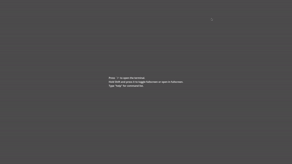

# TerminalMan
TerminalMan is an developer console addon for Godot Engine 4 written in GDScript that allows you to add custom commands.



## Usage
To add command, type:
```gdscript
Terminal.registerCmd("example",example,"Example command")
```
You can also specify up to 3 params:
```gdscript
Terminal.registerCmd("teleport",teleport,"Teleport to specified position or entity",3)
```

To remove:
```gdscript
Terminal.unregisterCmd("example")
```

## Features
- Basic command execution with ability to create custom commands, description, and parameters.
- Basic command history.
- Log to view printed lines.
- Scrollback.
- Basic command list with description if specified.

Some parts of the code has been taken from [jitspoe's godot-console](https://github.com/jitspoe/godot-console).

## Differences from jitspoe's console
- Rewritten and refactored.
- Different look from Quake III: Arena.
- Doesn't automatically create GUI elements in script.
- Uses custom input instead of LineEdit.
- Slide animation when opening, toggling fullscreen, or closing.
- *No autocompletion?*

It has been licensed under MIT license.
